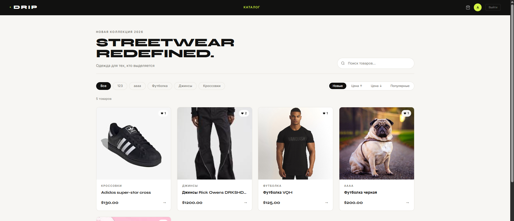

# web-store — E-commerce Platform
Интернет-магазин с оплатой через Stripe, фоновыми задачами и REST API

## Tech Stack
Python · Django · DRF · PostgreSQL · Celery · Redis · Stripe · HTMX · Pytest
## Features
- Оплата через Stripe (webhooks, обработка платежей)
- Фоновые задачи: email-уведомления, обработка заказов (Celery + Redis)
- REST API с авторизацией (DRF + JWT)
- Кастомная модель пользователя
- Корзина, заказы, история покупок

## Setup
git clone https://github.com/AAAArtteem21/web-store
cd magazzz
cp .env.example .env
pip install -r requirements.txt
python manage.py migrate
python manage.py runserver 

